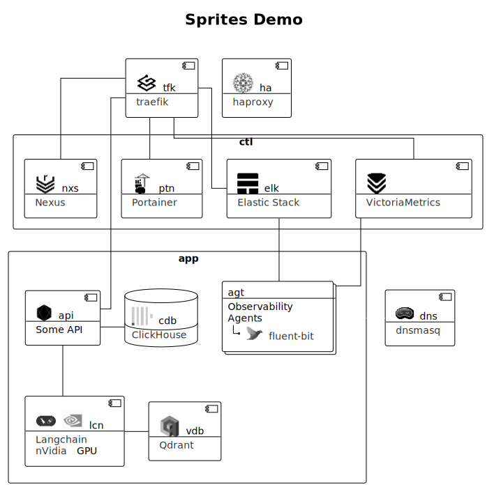

# puml-sprites

IT products logos sprites, that are missing in the PlantUML standard library. 

## Demo



## Usage Example

```plantuml
@startuml
'https://plantuml.com/component-diagram

!theme mono

!include https://raw.githubusercontent.com/bondden/puml-sprites/main/uml/sprites.puml

component tfk [
  <$traefik*.3> tfk
  --
  [[https://github.com/traefik/traefik/t traefik]]
]
```

----
© Denis Bondarenko 2024 

